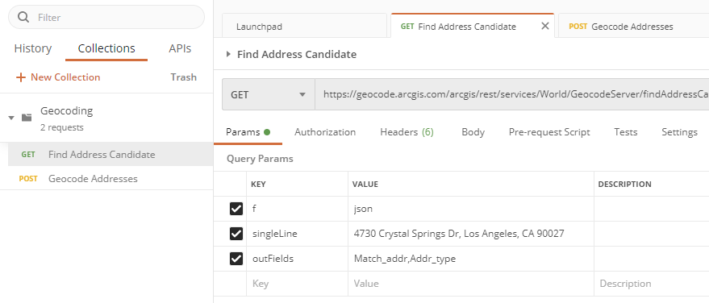
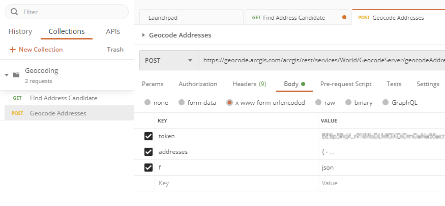

# SAS geocode

Use SAS and some APIs to geocode some addresses.

## Prereqs

### Using WPS to replacate SAS runtime

You may have an enterprise instance of SAS and an Enterprise instance of ESRI APIs, but want to develop offline a solution.  ESRI have free APIs for development use.  SAS has SAS university, or you can use WPS.  

Get the comminity edition.  

[Download](https://www.worldprogramming.com/try-or-buy/editions/)

### Using Postman

Install Postman:

[Download](https://www.postman.com/downloads/)

## This easy free one

This method uses the publically available ESRI API to find address candidates.  
At an enterprise you may have an internal version of this API?  



GET: `https://geocode.arcgis.com/arcgis/rest/services/World/GeocodeServer/findAddressCandidates`  
Parameteres: 
```ini
f='json'
singleLine='4730 Crystal Springs Dr, Los Angeles, CA 90027'
outFields='Match_addr,Addr_type'
```

Output: 
```json
{
    "spatialReference": {
        "wkid": 4326,
        "latestWkid": 4326
    },
    "candidates": [
        {
            "address": "4730 Crystal Springs Dr, Los Angeles, California, 90027",
            "location": {
                "x": -118.27290099965077,
                "y": 34.120139998439768
            },
            "score": 100,
            "attributes": {
                "Match_addr": "4730 Crystal Springs Dr, Los Angeles, California, 90027",
                "Addr_type": "PointAddress"
            },
            "extent": {
                "xmin": -118.27390099965078,
                "ymin": 34.119139998439771,
                "xmax": -118.27190099965077,
                "ymax": 34.121139998439766
            }
        },
        {
            "address": "4730 Crystal Springs Rd, Los Angeles, California, 90027",
            "location": {
                "x": -118.29234497561468,
                "y": 34.140624544224202
            },
            "score": 98.040000000000006,
            "attributes": {
                "Match_addr": "4730 Crystal Springs Rd, Los Angeles, California, 90027",
                "Addr_type": "StreetAddress"
            },
            "extent": {
                "xmin": -118.29334497561469,
                "ymin": 34.139624544224205,
                "xmax": -118.29134497561468,
                "ymax": 34.1416245442242
            }
        },
        {
            "address": "4730 Crystal Springs Rd, Los Angeles, California, 90027",
            "location": {
                "x": -118.29227308293807,
                "y": 34.140516730329004
            },
            "score": 98.040000000000006,
            "attributes": {
                "Match_addr": "4730 Crystal Springs Rd, Los Angeles, California, 90027",
                "Addr_type": "StreetAddress"
            },
            "extent": {
                "xmin": -118.29327308293807,
                "ymin": 34.139516730329007,
                "xmax": -118.29127308293806,
                "ymax": 34.141516730329002
            }
        }
    ]
}
```

### Now with SAS

Here is a way to do it manially. Surely you have a list of addresses in a table/file/dataset and you want to loop through these and generate the URL from the input data.  
So far this example hasn't built this level of automation.  Pull requests welcome.  

```sas
*  Get the current working directory (note this is for windows);
filename pwd pipe "echo %cd%";
data _null_;
  infile pwd;
  input;
  put _infile_;
  pwd=tranwrd(_infile_,'0d'x,'');
  call symputx('pwd',pwd);
run;
%put pwd: &pwd.;
libname geocode "&pwd.";

*	Make the call;
filename fac "&pwd.\findAddressCandidates.json" lrecl=100000000;
filename fac_h "&pwd.\findAddressCandidates.header";
proc http 
 method="GET"
 url='https://geocode.arcgis.com/arcgis/rest/services/World/GeocodeServer/findAddressCandidates?f=json&singleLine=4730%20Crystal%20Springs%20Dr,%20Los%20Angeles,%20CA%2090027&outFields=Match_addr,Addr_type'
 out=fac
 headerout=fac_h;
run;
```

## Calling an API with a complex nested JSON as input

This method uses the publically available ESRI API to geocode addresses in batch.  
It requires you to sign upp for a develop account to get a token.  



For this one we submit a POST request with a body using the `x-www-form-urlencoded` method.  

